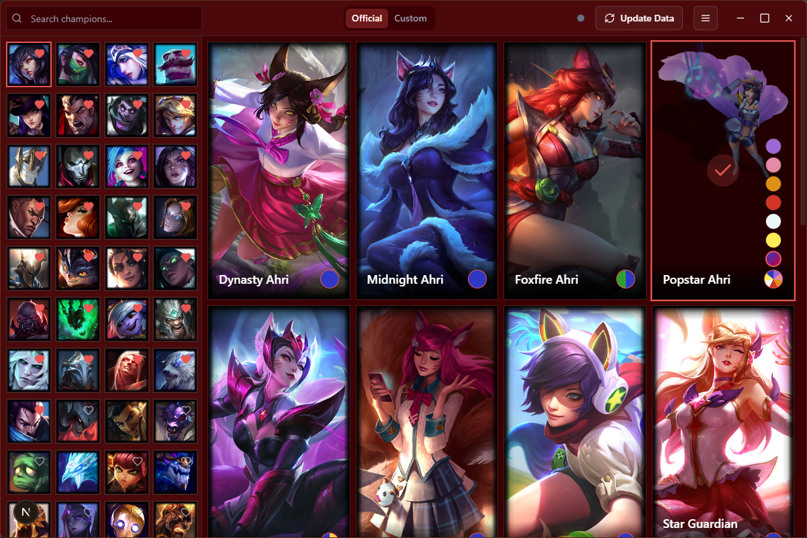

# Osskins



A cross‑platform desktop application built with Next.js, Tauri and TypeScript. Osskins lets you browse, search and manage custom skins for League of Legends on Windows with enhanced performance and user experience.

## 🌟 Key Features

### Core Functionality
- **Advanced Skin Management**  
  Browse, search, and manage both official and custom League of Legends skins with intelligent filtering and favorites system.

- **Real-time LCU Integration**  
  Seamless integration with League Client API for automatic champion detection and skin injection during champion select.

- **Custom Skin Support**  
  Full support for custom skins with easy installation, management, and real-time preview capabilities.

### Technical Excellence
- **Tauri + Next.js Architecture**  
  Combines Tauri's lightweight Rust backend with Next.js App Router (v15) and Static Site Generation for optimal performance.

- **Modern React Stack**  
  Built with React 19, TypeScript, Zustand for state management, and next-themes for seamless dark/light mode switching.

- **TailwindCSS v4**  
  Beautiful, responsive UI with utility‑first styling and customizable design system.

- **Accessible UI Components**  
  Comprehensive UI built with Radix UI primitives ensuring accessibility and consistent user experience.

### Advanced Features
- **Intelligent Search & Filtering**  
  Enhanced search with fuzzy matching, acronym support, and relevance scoring for quick champion discovery.

- **Performance Optimizations**  
  - Concurrent data processing with rate limiting
  - Intelligent caching and memoization
  - Optimized batch operations
  - Automatic cleanup and memory management

- **Party Mode** (Upcoming)  
  Sync skin selections with friends for coordinated team aesthetics.

- **Auto-Update System**  
  Automatic champion data updates with progress tracking and error recovery.

## 🏗️ Architecture

### Project Structure
- **`src/components`** - Reusable UI components and domain-specific components
- **`src/hooks`** - Custom React hooks for data fetching, state management, and business logic
- **`src/lib`** - Utilities, data processing, and shared libraries
- **`src-tauri/src`** - Rust backend with Tauri commands and system integrations

### Key Improvements in This Version
- **Enhanced Error Handling** - Comprehensive error recovery with retry mechanisms
- **Performance Optimizations** - Reduced memory usage and faster data processing
- **Better Type Safety** - Improved TypeScript definitions and runtime validation
- **Modular Architecture** - Better separation of concerns and code organization
- **Advanced State Management** - Optimized Zustand store with persistence and selectors

## 🚀 Prerequisites

- **Node.js** ≥18 with pnpm package manager
- **Rust toolchain** (`rustup`, `cargo`)
- **Windows 10+** (for Tauri's native window functionality)
- **League of Legends** client installed

## 📦 Installation

1. **Clone the repository**
   ```bash
   git clone https://github.com/nerowah/lol-skins-developer.git
   cd lol-skins-developer
   ```

2. **Install dependencies**
   ```bash
   pnpm install
   ```

3. **Setup Rust environment**
   ```bash
   # Install Rust if not already installed
   curl --proto '=https' --tlsv1.2 -sSf https://sh.rustup.rs | sh
   
   # Add Tauri CLI
   cargo install tauri-cli
   ```

## 🛠️ Development

### Development Server
```bash
# Start Next.js development server with Turbopack
pnpm dev

# Start Tauri development environment
pnpm tauri dev

# Run with administrator privileges (Windows)
pnpm dev:admin
```

### Building
```bash
# Build the web application
pnpm build

# Build Tauri application
pnpm tauri build
```

### Code Quality
```bash
# Run linting
pnpm lint

# Type checking
pnpm type-check
```

## 🔧 Configuration

### League of Legends Integration
1. **Automatic Detection** - The app will attempt to auto-detect your League installation
2. **Manual Setup** - If auto-detection fails, manually specify your League directory
3. **LCU Connection** - Ensure League Client is running for real-time features

### Performance Tuning
- **Cache Management** - Automatic cleanup of old data and optimized caching
- **Batch Processing** - Configurable batch sizes for data updates
- **Rate Limiting** - Built-in API rate limiting to prevent service overload

## 🎯 Usage

1. **First Launch**
   - Complete the onboarding process
   - Set your League of Legends directory
   - Allow the app to download champion data

2. **Managing Skins**
   - Browse champions using the search and filter system
   - Add champions to favorites for quick access
   - Select official skins or upload custom skins
   - Use the injection system during champion select

3. **Advanced Features**
   - Enable auto-updates for the latest champion data
   - Customize app settings and appearance
   - Monitor injection status and logs

## 🔄 Updates & Data Management

The application includes an intelligent update system:
- **Automatic Updates** - Optional auto-update of champion data
- **Manual Updates** - Force refresh of champion and skin data
- **Incremental Updates** - Only download changed data for efficiency
- **Rollback Support** - Restore previous data states if needed

## 🐛 Troubleshooting

### Common Issues
- **LCU Connection Failed** - Ensure League Client is running and not blocked by firewall
- **Skin Injection Failed** - Check file permissions and antivirus settings
- **Data Update Errors** - Verify internet connection and try manual update

### Debug Mode
Enable debug mode in settings for detailed logging and troubleshooting information.

## 🛡️ Security & Privacy

- **Local Processing** - All skin data processed locally for privacy
- **Secure Updates** - Verified downloads with integrity checking
- **No Data Collection** - No personal information sent to external servers
- **Open Source** - Full transparency with open source codebase

## 🤝 Contributing

We welcome contributions! Please see our contributing guidelines for:
- Code style and conventions
- Pull request process
- Issue reporting
- Feature development

## 📄 License

This project is licensed under the MIT License - see the [LICENSE](LICENSE) file for details.

## 🙏 Acknowledgments

- **Community Dragon** - For providing League of Legends asset APIs
- **Riot Games** - For creating League of Legends
- **Open Source Community** - For the amazing tools and libraries that make this possible

## 📞 Support

- **Issues** - Report bugs and request features on GitHub Issues
- **Community** - Join our Discord for community support
- **Documentation** - Detailed docs available in the `/docs` directory

---

**Note**: This application is not affiliated with Riot Games. League of Legends is a trademark of Riot Games, Inc.
